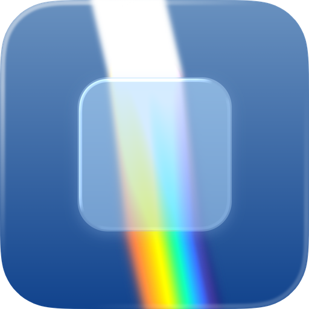
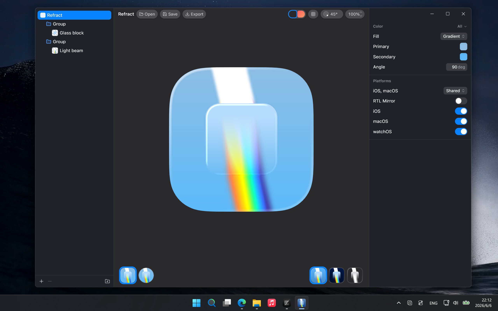
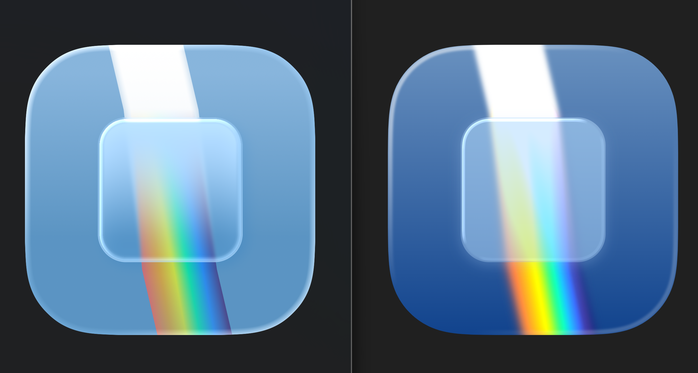

# Refract

<a href="https://github.com/6xingyv/refract/stargazers">
    
</a>
<a href="https://github.com/6xingyv/refract/releases/latest">
    
</a>

Authors `.icon` files and renders icons with the Liquid Glass effect.

## 👓 Preview



### 🥇 Comparison



Left: Icon Composer by Apple

Right: Refract

(Please ignore the difference in background colors)

## 💻 Develop

```bash
bun install
bun tauri dev
```

`bun run dev` runs the web frontend alone (Open/Save need the Tauri shell; rendering uses
WebGPU when available and automatically falls back to WebGL2).

Auto-update release setup is documented in [docs/UPDATER.md](./docs/UPDATER.md).

## 📦 Build

```bash
bun tauri build
```

## 📄 License

Refract is licensed under the [Mozilla Public License 2.0](./LICENSE).
Commercial use is welcome. If Refract benefits your work or business,
please consider sponsoring its development or contributing generally useful
improvements upstream.
