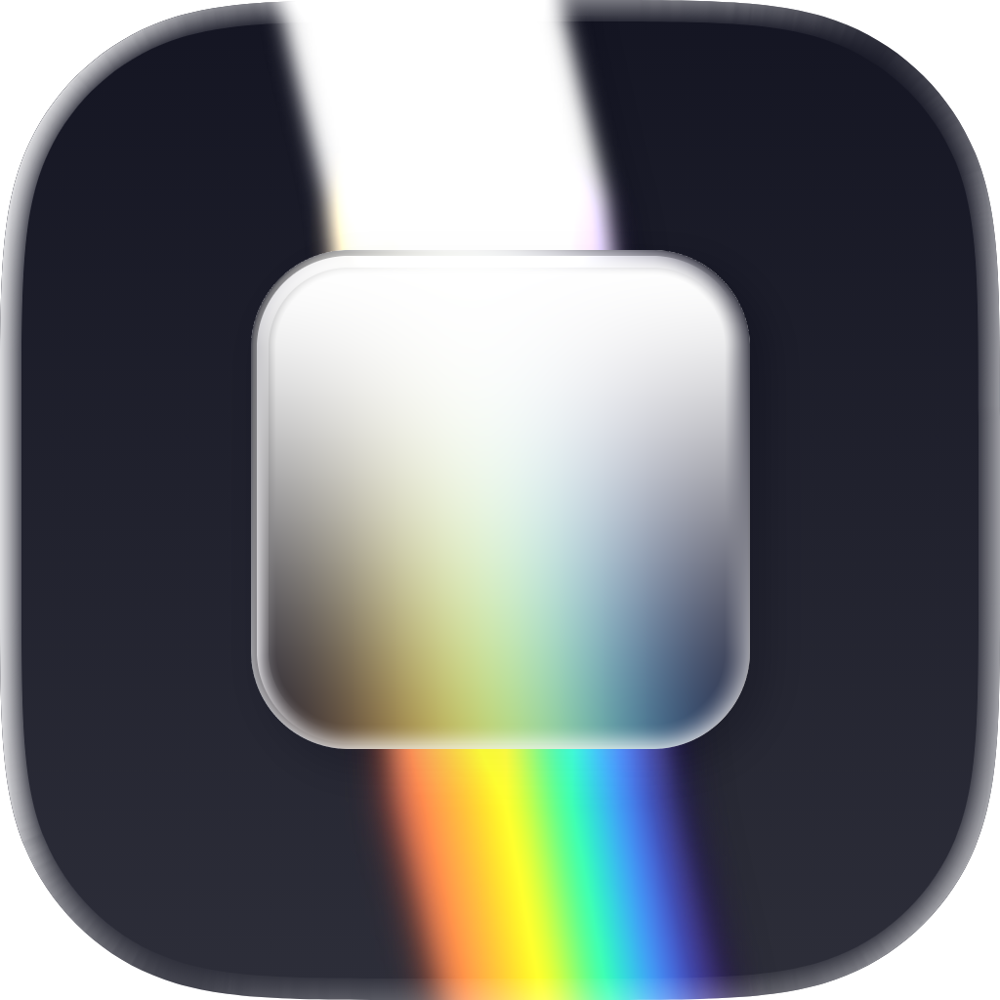
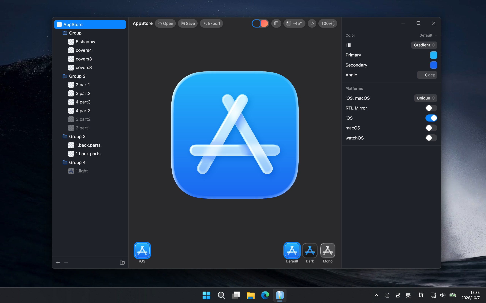
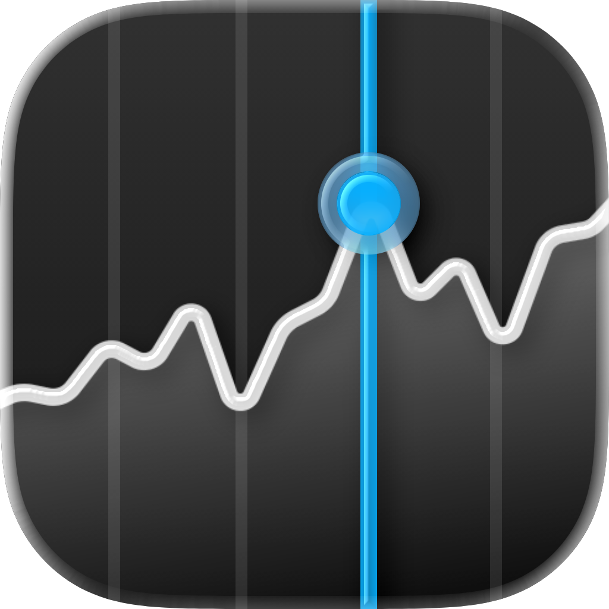

# Refract

<a href="https://github.com/6xingyv/refract/stargazers">
    
</a>
<a href="https://github.com/6xingyv/refract/releases/latest">
    
</a>

Authors `.icon` files and renders icons with the Liquid Glass effect.

## 👓 Preview



### Rendering Results

Some default app icons rendered by Refract.

<table>
  <tr>
    <td align="center">
      <a href="./docs/img/results/AppStore-iOS-Default.png"></a><br/>
      App Store
    </td>
    <td align="center">
      <a href="./docs/img/results/Books-iOS-Default.png"></a><br/>
      Books
    </td>
    <td align="center">
      <a href="./docs/img/results/FaceTime-iOS-Default.png"></a><br/>
      FaceTime
    </td>
  </tr>
  <tr>
    <td align="center">
      <a href="./docs/img/results/Games-iOS-Default.png"></a><br/>
      Games
    </td>
    <td align="center">
      <a href="./docs/img/results/Journal-iOS-Default.png"></a><br/>
      Journal
    </td>
    <td align="center">
      <a href="./docs/img/results/Maps-iOS-Default.png"></a><br/>
      Maps
    </td>
  </tr>
  <tr>
    <td align="center">
      <a href="./docs/img/results/MobileSafari-iOS-Default.png"></a><br/>
      Safari
    </td>
    <td align="center">
      <a href="./docs/img/results/Stocks-iOS-Default.png"></a><br/>
      Stocks
    </td>
    <td align="center">
      <a href="./docs/img/results/Weather-iOS-Default.png"></a><br/>
      Weather
    </td>
  </tr>
</table>

## 💻 Develop

```bash
bun install
bun tauri dev
```

`bun run dev` runs the web frontend alone (Open/Save need the Tauri shell; rendering uses
WebGPU when available and automatically falls back to WebGL2).

## 📦 Build

```bash
bun tauri build
```

## 📄 License

Refract is licensed under the [Mozilla Public License 2.0](./LICENSE).
Commercial use is welcome. If Refract benefits your work or business,
please consider sponsoring its development or contributing generally useful
improvements upstream.
